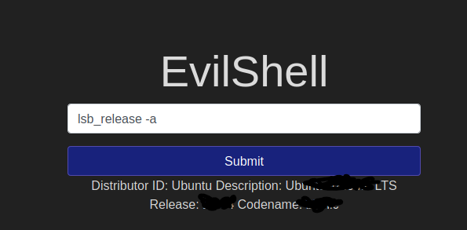

## Day 1 
### Command injection
Task 4 and 5 are about command injection and they will be useful for thos who have no prior knowledge of this topic. I highly suggest a carefull reading if you're new to this otherwise a quick one will suffice
#### Task 6 ~ Practical 
Evilshell.php again... How nostalgic

They explains pretty well how it works

There are some commands thm suggest to try it out and some will come in handy very soon.

> whoami

and everytime i see i php i wanna know the version so just because i'm used too i usually run

> php -v

Almost the last one so probably it won't be useful.

#### Let's start with the subtasks
###### #1
For the first one just lemme remind you that when you see root directory it represent the directory of the server not the "/root", especially for web server. Just with a quick pwd
you can see you're in the server root so for the first subtask just type 
> ls

There is only one eyecatching file so it probably is the answer. Yes it is.

###### #2
The next one requires you to access a known file, to access the users you can simply type this
> cut -d: -f1 /etc/passwd 

and the only step remaining is to count the non-root, non-deamon and non-service users.
The answer should be easy to grasp (I'll remind you non-root too, at first counting i forgot that :sweat_smile:)

###### #3
For the subtask #3 we'll already have the answer from the "whoami" typed as first.

###### #4
Even for the subtask #4 is just one line command
> cat /etc/passwd | grep OurUser
Where OurUser is the answer from the precedent task and we have the answer for this task too.

###### #5
Same as the subtask #5 just one line command

###### #6

For the remaining subtask it was a not so lucky guess, when we found the first file I "cat" it out and I tryed to guess it was the favourite drink.
The **right** way to do it is just finding and catting the header with this command
> cat /etc/update-motd.d/00-header

And we completed the Day 1, let's wait for the Day 2 who will be live tomorrow at 21 PM