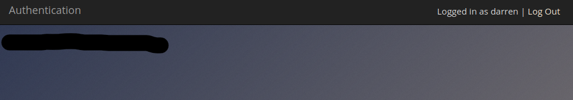

## Day 2 
### Broken Authentication
Task 7 is a quick guide of how this works, what it would be a good authentication process and how password's policy should deal with it.
#### Task 8 ~ Practical 

Actually this day was just a connect-the-dot day, easy to follow and not much to think about. The sum up of authentication was very good tho.

Just going in the webserver login page which is on 8888 port. First I checked there is an account for a username "darren", yes it was there so we follow the method because we already 
know this authentication process is vulnerable and we create a new user with a whitespace at the start of the username.
Then we log-in in that account and it triggers the flag

Repeat the process for the "arthur" user and we got this day in the bag

