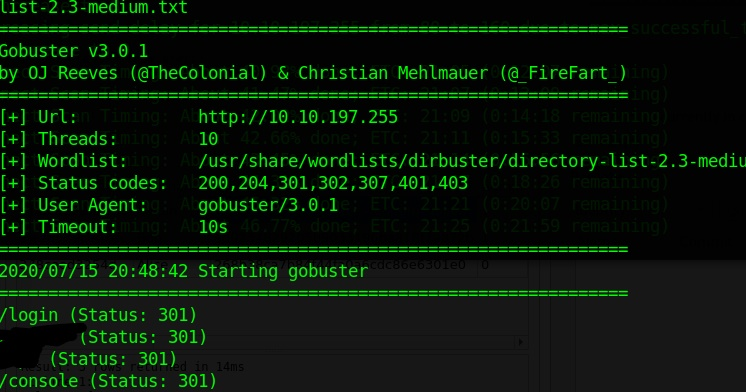
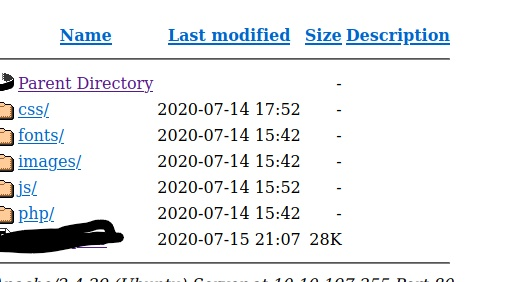
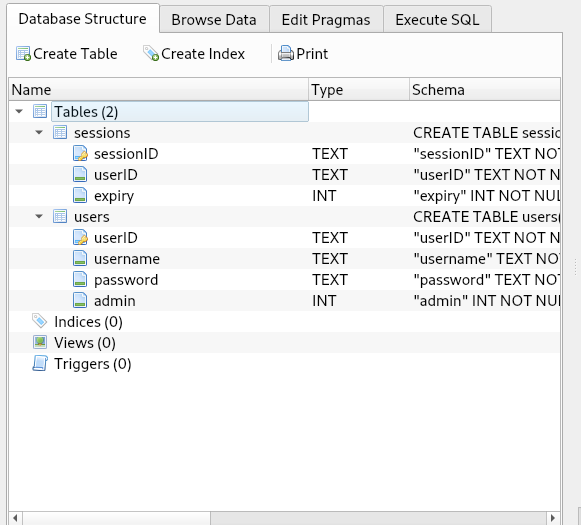
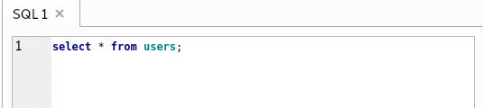
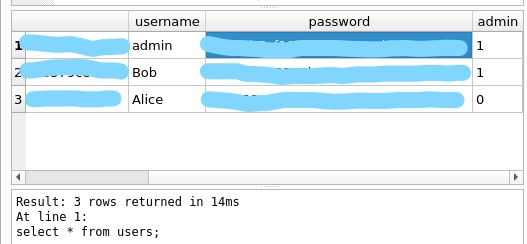
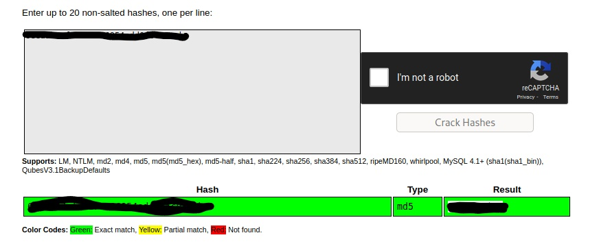
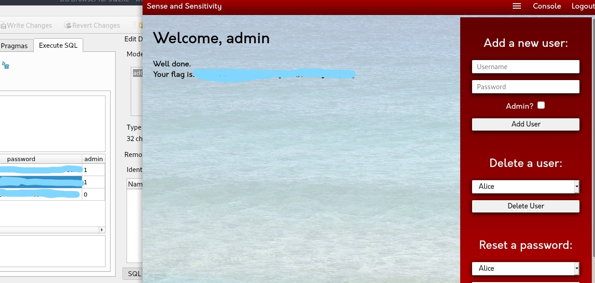
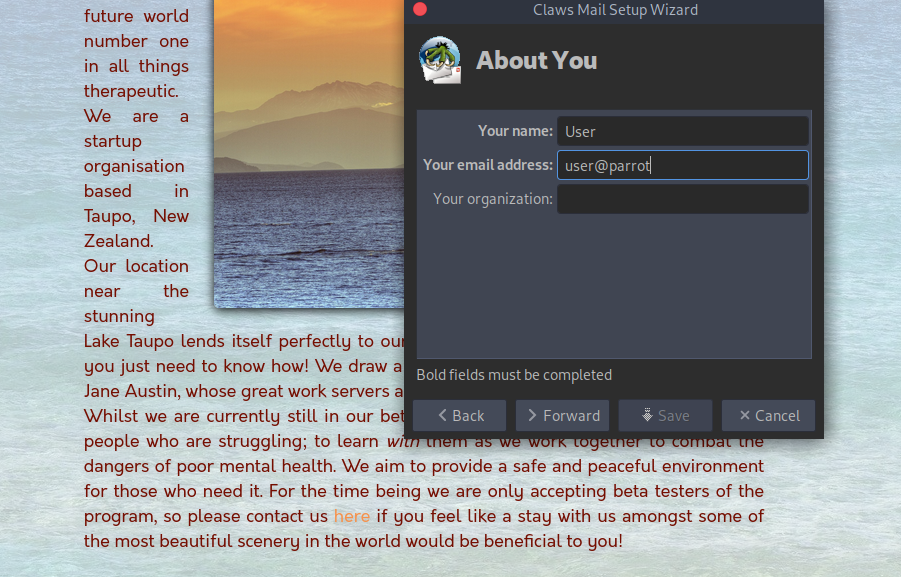
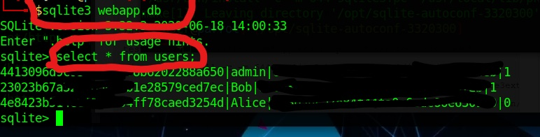
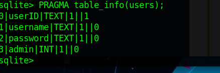

## Day 3
### Sensitive Data Exposure
The first tasks are about query, file-file datatabase and sqlite3. If you are familiar with these topics then you can start with the practical question right away, if not read carefully because if you grasp what they are saying today's task shouldn't be difficult
#### Task 12 ~ Practical 
As always i started in background nmap and gobuster on the box

When it comes to which wordlist is better i usually goes with medium and if I think I missed something i could go the big one but the medium works just fine for these challenges

We can notice a /login, expected not much usefull for now, a /console interesting but if you go on that page it requires you to login, so not so interesting for now.
The next one is very usefull because when we gon on that page we get this. 
Lucky us we get this one in the easier way :dancer:

Here it was the .db file that was requested. Now u can get it in different ways, choose one.

Thm suggested to use sqlite3 but i didnt't have it installed when it was released so i used a different one called sqlitebrowser; open the .db.

It's very important to understand what is the structure of the db, so in users we got userID, username, password hash and an int who explicit if the user is admin or not.

Now let's check which user is inside the db with a simple query.

And we got this result

So instead of using a cracking tool for the hashes let's use the online crackstationtool because they assured this one contains the password, so it's fine otherwise i'd reccomend using a proper tool.

In a few second the tool cracked the md5 hash (that's why this hashing algorith is obsolete). Now if we go in the login page and we enter the user and password we have cracked (admin) we should be able to login and get the flag.

For the sake of the challenge there was a hint and a voucher, the hint was located in the second user (Bob) successfull-login page.

And to get the voucher it was only needed to e-mail them like this.

After the completition of this day I installed sqlite3 to show the suggested path to open and query the .db

Open the .db

To know which field was what just run this too to get the structure of the table

And the result was the same.

Let's wait tomorrow for the release of Day 4 :nerd_face:

