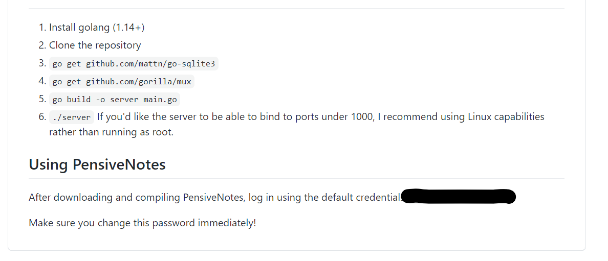
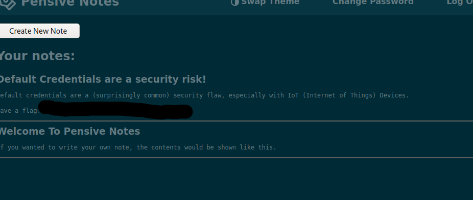

# Day 6
## Security Misconfiguration

This day was about security misconfiguration, when admins fails to implement a correct security of the webapp/app/site that can cause an attacker an easy way in.
A common but easy example is default passwords and this day is about finding the default password of the webapp.
First we google it, at first it wasn't indexed by google so it didn't show any result now it should be indexed even by google, then we narrow the field to popular sites like github and it was easy to find. 

Next we find the flag right after the login 

