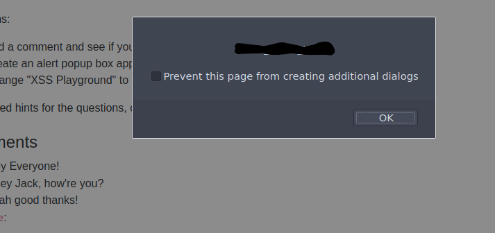

# Day 7
## Cross-site Scripting

This day's challenge is very interesting : xss.
First thing first we check by using a simple alert that that site is vulnerable to xss and it is.



Using <script>alert(“Hello World”)</script> .
Other questions are about the same topic but gathering different information like using the ip addr of the machine you're using (like the hin suggested with window.location.hostname)

```html
<script>alert(window.location.hostname)</script>
```
To get the cookie session I just used 

```html
<script>alert(document.cookie)</script>
```

For the task #4 just add a simple paragraph or an h1 with <p> or <h1>.

For the next one as you can find it in the source code too it'll call the function(answer) if the check on document.querySelector('#thm-title').textContent == 'I am a hacker'
Then we use it.

```html
<script>document.querySelector('THM ~ XSS Playground').textContent = 'I am a hacker'</script>
```
And that's it for today.


