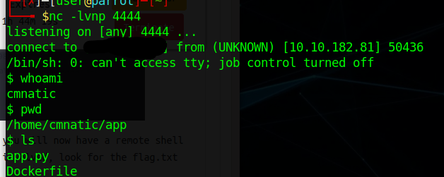
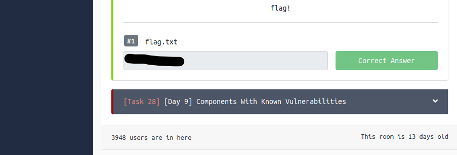

# Day 8
## Insecure Deserialization

This topic is very important to understand and it's explained pretty well, read carefully and answer to the questions (answers are found in the text). 
Serialization is a mechanism of converting the state of an object into a byte stream. 
Deserialization is the reverse process where the byte stream is used to recreate the complex object.

I visit the ip and a registration is required so we register with simple credentials, after that we go to inspect the cookie and we find that one is base64 encoded we use the base64 --decode
to get the first flag

After that we notice that in the cookie there is the user type, strage but modifying the user type to admin and refreshing the page we are now admin

The next task is RCE on the ip. 

Following their step by step you should get the shell easy enough. First we create a python file and we paste the script (modifying the ip with tun0 ip your machine have)
that encode that command to base64 and then we copy the 
encoded command into the encoded payload in the cookies but first get a shell and start a netcat listener with 

> nc -lvnp 4444

(4444 as the example or use whatever port you used in the script ). And after the enter you should get the shell. 
 
 
 
 
 You are required to look for the flag.txt, just using a find to locate it or navigate it manually trying to find it, your choice.
 
 
 
 And we got the flag !
 
 
