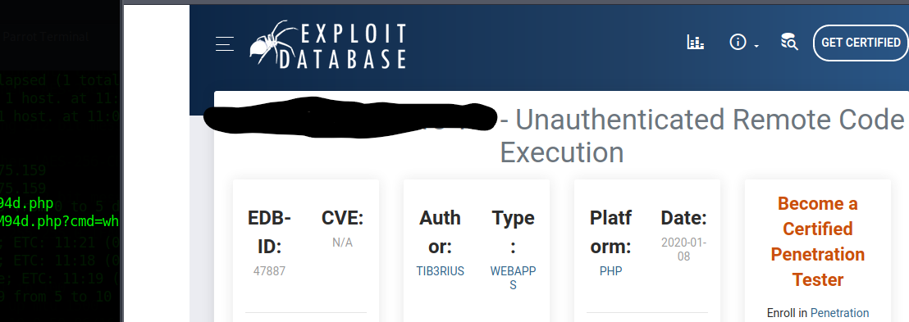
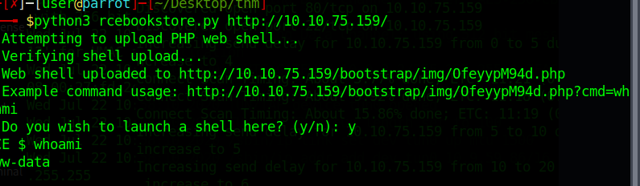

# Day 9
## Components With Known Vulnerabilities

The machine is about a bookstore, just use the tool they just explained (dbexploit) and it's the [first](https://www.exploit-db.com/exploits/47887) result after looking for "Book store unauthenticated remote code execution"

We download the script and we use python3 and the filename (mine was rcebookstore.py) and we get the error and the usage syntax that is python3 name.py url
So we type

And we get the shell in the same shell we were working.

Now just using wc on the passwd file to get the answer you're looking for.

> wc -c /etc/passwd
