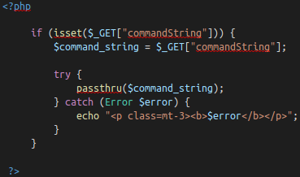

# THMOwasptop10-WriteUp
### Write Up of the new THM room : Owasptop10
Task 1 to 3 are just information about the challenge, just do a quick reading and let's start with day 1
***
## Day 1 
### Command injection
Task 4 and 5 are about command injection and they will be useful for thos who have no prior knowledge of this topic. I highly suggest a carefull reading if you're new to this otherwise a quick one will suffice
#### Task 6 ~ Practical 
Evilshell.php again... How nostalgic

They explains pretty well how it works

There are some commands thm suggest to try it out and some will come in handy very soon.

> whoami

and everytime i see i php i wanna know the version so just because i'm used too i usually run

> php -v

Almost the last one so probably it won't be useful.

###### Let's start with the subtasks
For the first one just lemme remind you that when you see root directory it represent the directory of the server not the "/root", especially for web server. Just with a quick pwd
you can see you're in the server root so for the first subtask just type 
> ls
There is only one eyecatching file so it probably is the answer. Yes it is.
The next one requires you to access a known file, to access the users you can simply type this
> cut -d: -f1 /etc/passwd 
and the only step remaining is to count the non-root, non-deamon and non-service users.
The answer should be easy to grasp (I'll remind you non-root too, at first counting i forgot that :sweat_smile:)

